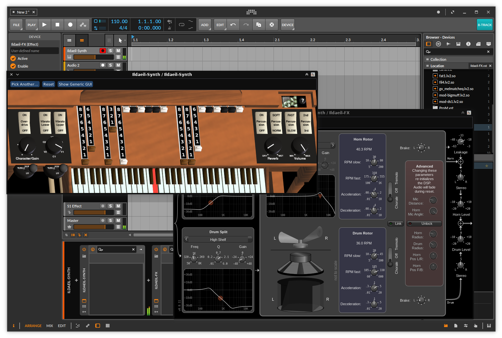

# DISTRHO Ildaeil

DISTRHO Ildaeil is mini-plugin host working as a plugin, allowing one-to-one plugin format reusage.  
The idea is to load it as a plugin inside your DAW and then the other "real" plugin inside Ildaeil.  
This allows, for example, a VST3 host to load LV2 plugins.

The Ildaeil name comes from the korean 일대일, which means "one to one".

## Details

Ildaeil basically works as a mini-wrapper around [Carla](https://github.com/falkTX/Carla), leveraging it for all its host support.  
Everything should be working except plugin parameters (none are exposed to the host).

When open, Ildaeil will show a list of plugins to pick from or the plugin editor if one is already selected.

If the plugin provides an embeddable UI, Ildaeil show will that by default, otherwise it shows a generic parameter list.  
Toggling between generic vs custom/embed view is possible.  
In the case of a plugin providing a custom UI that is not embeddable, Ildaeil will show the generic view by default.  
You can press "Show Custom GUI" to open the plugin UI in an external window.

## Features

The current formats Ildaeil can work as are:

- JACK/Standalone
- CLAP
- LV2
- VST2
- VST3

And it can load the following plugin formats:

- Internal (from Carla)
- LV2
- JSFX

With a few extra formats through the "Load from file..." action:

- CLAP plugins
- VST2 plugins
- Audio files (through internal audio file player, synced to transport)
- MIDI files (through internal MIDI file player, synced to transport)
- SFZ files (through internal SFZero)

## Goals

Later on, in theory, it should be able to load the following plugin formats:

- LADSPA
- DSSI
- VST3
- AU (macOS only)

Eventually the following files could be loaded too:

- SF2/3 files (through internal FluidSynth)

## Screenshots

### Plugin list

Your typical view before loading a plugin

### Generic plugin GUI

The integrated generic controls, typically used for GUI-less plugins

### Bitwig with setBfree

setBfree as synth, with its own whirl speaker as FX, inside Bitwig.

### CAPS in Cubase

A few [CAPS plugins](https://github.com/moddevices/caps-lv2) running inside Cubase, though UI resizing doesn't seem to work.

### FLStudio and various plugins

Vex as synth, [DIE-Plugins](https://github.com/DISTRHO/DIE-Plugins) and [OpenAV Filta](https://github.com/openAVproductions/openAV-ArtyFX) as FX, running in FLStudio.

### Renoise with Aether

Another LV2-only plugin, [Aether](https://github.com/Dougal-s/Aether), running in Renoise.

