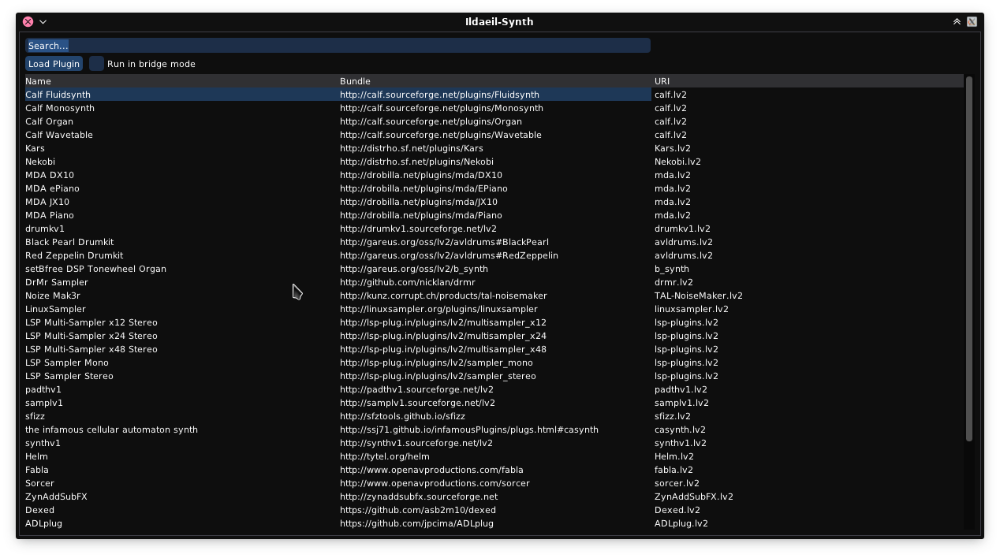
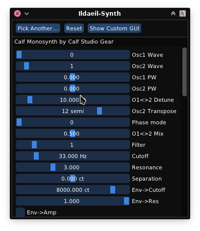

# DISTRHO Ildaeil

DISTRHO Ildaeil is mini-plugin host working as a plugin, allowing one-to-one plugin format reusage.  
The idea is to load it as a plugin inside your DAW and then other the "real" plugin inside Ildaeil.  
This allows, for example, a VST3 host to load LV2 plugins.

The Ildaeil name comes from the korean 일대일, which means "one to one".

THIS IS CURRENTLY A WORK IN PROGRESS.

## Details

Ildaeil basically works as a mini-wrapper around [Carla](https://github.com/falkTX/Carla), leveraging it for all its host support.  
Everything should be working except plugin parameters (none are exposed to the host).  
Also, **only LV2 hosting is enabled at the moment**.

When open, Ildaeil will show a list of plugins to pick from or the plugin editor if one is already selected.

If the plugin provides an embedable UI, Ildaeil show will that by default, otherwise it shows a generic parameter list.  
Toggling between generic vs custom/embed view is possible.  
In the case of a plugin providing a custom UI that is not embedable, Ildaeil will show the generic view by default.  
You can press "Show Custom GUI" to open the plugin UI in an external window.

## Features

The current formats Ildaeil can work as are:

- JACK/Standalone
- LV2
- VST2
- VST3

And it can load the following plugin formats:
- LV2

## Goals

Later on, in theory, should be able to load the following plugin formats:

- LADSPA
- DSSI
- VST2
- VST3
- AU (macOS only)

Additionally the following files could eventually be loaded:

- Audio files (synced to host transport)
- MIDI files (aligned to real/wall-clock time, synced to host transport)
- SF2/3 files (through internal FluidSynth)
- SFZ files (through internal SFZero)
